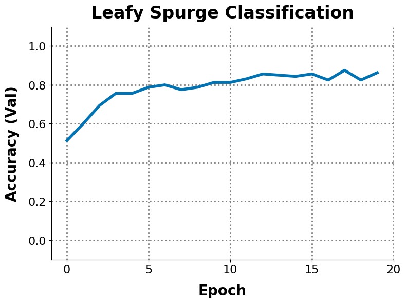

# 🌱 Leafy Spurge Dataset

<p float="left">
   &nbsp;&nbsp;&nbsp;&nbsp;
  
</p>

__Leafy Spurge Dataset__ is a challenging real-world benchmark to galvanize efforts to find and remove invasive plants within drone imagery of the Montana prairie, and restore natural ecosystems in Montana.

[Paper](https://leafy-spurge-dataset.github.io/static/paper.pdf) &nbsp;&nbsp;|&nbsp;&nbsp; [Website](https://leafy-spurge-dataset.github.io) &nbsp;&nbsp;|&nbsp;&nbsp; [HuggingFace](https://huggingface.co/datasets/mpg-ranch/leafy_spurge) &nbsp;&nbsp;|&nbsp;&nbsp; [🌱 Leafy Spurge + Data Augmentation](https://arxiv.org/abs/2302.07944)

## Installation

🌱 Leafy Spurge Dataset can be installed using our pip package.

```bash
pip install leafy-spurge-dataset
```

This will install all necessary dependencies.

## Using The Dataset

The benchmark includes a `torch.utils.data.Dataset` compatible loader for 🌱 Leafy Spurge Dataset, and a simple training, evaluation, and plotting interface. This loader can be imported using:

```python
from leafy_spurge_dataset import LeafySpurgeDataset

dataset = LeafySpurgeDataset(
    split="train",
    version="crop",
)

print(len(dataset))
# 800

print(dataset[0])
# (PIL.Image.Image, 0)

```

Available splits are `train`, `test`. Available versions are `crop` (`39x39`) and `context` (`1024x1024`).

Iterating through the dataset returns tuples of `PIL.Image.Image` and a class label. Additional metadata is available for each training example, including example idx, latitude, longitude, easting, northing, elevation, time, and plant cluster id. These can be returned by the dataset by setting `output_dict=True` as below:

```python
from leafy_spurge_dataset import LeafySpurgeDataset

dataset = LeafySpurgeDataset(
    split="train",
    version="crop",
    output_dict=True,
)

print(dataset[0])
# {'image': PIL.Image.Image, 'label': 0, 'idx': 104, 'longitude': -114.03648818, 'latitude': 46.70476716, 'easting': 726534.8359659711, 'northing': 5176622.677234786, 'elevation': 1001.154, 'time': 20230612120503.7, 'cluster': 1}

```

Our `LeafySpurgeDataset` is compatible with the PyTorch DataLoader, and transforms. The following example shows how to load random batches of 32 images from the 🌱 Leafy Spurge training set, at resolution `224x224`, normalized using ImageNet statistics.

```python
from leafy_spurge_dataset import LeafySpurgeDataset
from torchvision.transforms import v2
from torch.utils.data import DataLoader

transform = v2.Compose([
    v2.Resize(size=(224, 224), antialias=True),
    v2.ToImage(),
    v2.ToDtype(torch.float32, scale=True),
    v2.Normalize(
        mean=[0.485, 0.456, 0.406],
        std=[0.229, 0.224, 0.225],
    ),
])

train_dataset = LeafySpurgeDataset(
    split="train",
    version="crop",
    output_dict=True,
    transform=transform,
)

dataloader = DataLoader(
    train_dataset,
    batch_size=32,
    shuffle=True,
)

```

Cheers, and happy model training!

## Quickstart

The benchmark can generate starter files that fine-tune DINOv2 with LoRA to classify 🌱 Leafy Spurge. Running the following command in your terminal:

```bash
leafy-spurge quickstart
```

Will generate two files in your current directory: `leafy_spurge_train_classifier.py` for training DINOv2, and `leafy_spurge_plot_results.py` for plotting results that were logged by the training script.

The training script can be called with:

```bash
python leafy_spurge_train_classifier.py \
--batch_size 32 \
--num_epochs 100 \
--lr 0.0001 \
--seed 42 \
--output_dir output
```

Running this script will train DINOv2 to classify 🌱 Leafy Spurge using LoRA, and will save results in a folder called `output`. This folder will contain a `data.csv` file with logged training, and validation classification accuracy every epoch, and final test accuracy on the official test set.

The results in `data.csv` can be plotted using:

```bash
python leafy_spurge_plot_results.py \
--csv_file_name output/data.csv \
--plot_file_name plot.png
```

<br />

<br />

This will create a file `plot.png` (shown above) that visualizes the validation accuracy per epoch. If you have multiple runs, changing to `--csv_file_name */data.csv` will use `glob` to load multiple `data.csv` files, and the resulting `plot.png` will contain a legend if more than one method is present.

The quickstart plotting script will compute a 95% confidence interval if multiple trials of the same method are present in `*/data.csv`.

### Command Line Interface

The default training script is also available via a command-line interface.

```bash
leafy-spurge train \
--batch_size 32 \
--num_epochs 100 \
--lr 0.0001 \
--seed 42 \
--output_dir output
```

Similarly, the default plotting script is available via a command-line interface.

```bash
leafy-spurge plot \
--csv_file_name output/data.csv \
--plot_file_name plot.png
```

These can reproduce the results in our paper, without you writing a single line of code.

## Citing Our Work

If you use our dataset, you can support our work by citing our benchmark paper.

```
@misc{Doherty2024LeafySpurgeDataset,
  title={Leafy Spurge Dataset: Real-world Weed Classification Within Aerial Drone Imagery},
  howpublished={https://leafy-spurge-dataset.github.io/static/paper.pdf},
  author={
Kyle Doherty,
Max Gurinas,
Erik Samsoe,
Charles Casper,
Beau Larkin,
Philip Ramsey,
Brandon Trabucco,
Ruslan Salakhutdinov},
  year={2024},
}
```

And our paper on few-shot learning with 🌱 Leafy Spurge Dataset.

```
@misc{Trabucco2023DataAugmentation,
      title={Effective Data Augmentation With Diffusion Models}, 
      author={
Brandon Trabucco,
Kyle Doherty,
Max Gurinas,
Ruslan Salakhutdinov},
      year={2023},
      eprint={2302.07944},
      archivePrefix={arXiv},
      primaryClass={cs.CV}
}
```
